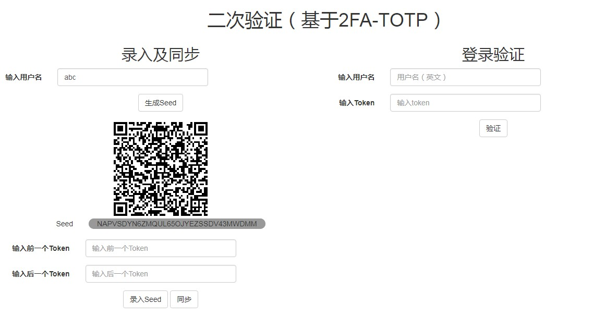

# TOTP Demo

这是一个**pin码+opt令牌**注册和验证的demo，api用flask搭建，前端用jquery搭建。

## 预览

## 注意
1. token使用一次之后必须过期，防止钓鱼攻击
2. 时间同步可以参考RFC的section-6
3. seed的保存非常重要，一定不能泄漏
4. pin码本质上就是一个普通的密码，pin码更新可以通过其他途径来进行：比如用另外一套账号密码来更新，给账号发送邮件进行修改等
5. 这套程序只是一个demo，切勿直接运行在生产环境

## 参考资料
* RFC: https://tools.ietf.org/html/rfc6238
* zhihu: https://zhuanlan.zhihu.com/p/34411202
* pyotp: https://github.com/pyotp/pyotp
