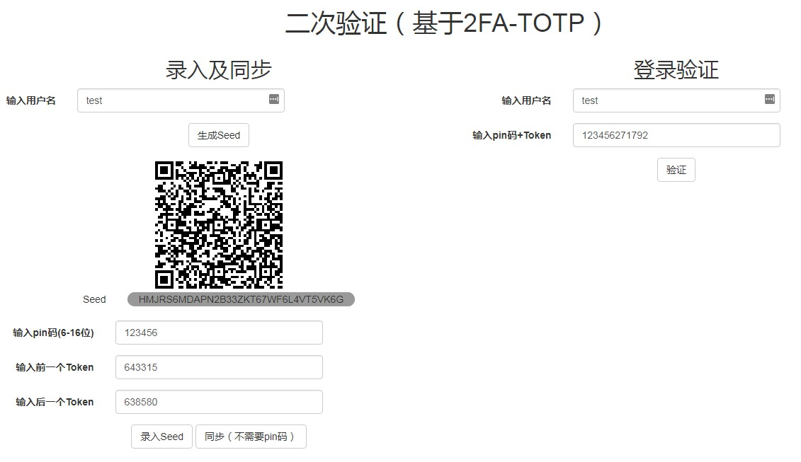

# TOTP Demo

## 预览

## 注意
1. token使用一次之后必须过期，防止钓鱼攻击
2. 时间同步可以参考RFC的section-6
3. seed的保存非常重要，一定不能泄漏

## 参考资料
* RFC: https://tools.ietf.org/html/rfc6238
* zhihu: https://zhuanlan.zhihu.com/p/34411202
* pyotp: https://github.com/pyotp/pyotp
